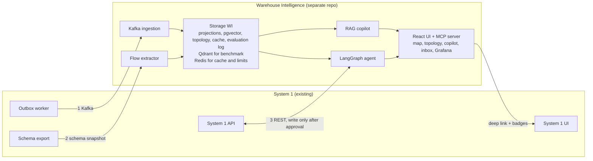

# Warehouse Intelligence: AI System Architecture

2026-10-02 · Razvan

## 1. Purpose and positioning

Warehouse Intelligence is the second project in the portfolio: a separate AI layer attached to System 1 that makes it easier to understand, operate and debug. It is not a chatbot on top of data. It is a measured system where every answer has a full trace and quality is evaluated automatically.

The target is the AI Engineer role. The project covers RAG (Retrieval Augmented Generation, answers grounded in retrieved documents), vector and hybrid search, agents with tools, evaluation, observability, LLM security and MCP (Model Context Protocol, a standard for connecting tools to LLMs).

The honest positioning: an AI Engineer focused on production systems, who built, evaluated and secured a RAG + agent system on top of a real system. The project does not cover training LLMs or classical statistical modeling. The machine learning part is fine-tuning an embeddings model with PyTorch and Transformers, in weeks 8 and 9.

| Skill | Where it appears |
|---|---|
| Embeddings and incremental indexing | Module C, Kafka consumer |
| Hybrid search and reranking | Module C |
| Intent router, safe text-to-SQL | Module C |
| Agents with tools and human approval | Module D |
| MCP | Module D |
| Automated evaluation, golden set, LLM-as-judge | Module F |
| LLM observability, cost, latency | Section 12 |
| LLM security, RBAC at retrieval | Section 11 |
| Distributed systems: Kafka, outbox, idempotency | Section 4 |
| Visual product: map, graph, explorer | Modules A, B, E |

## 2. Design principles

Nine rules guide every decision in the project. When two solutions look equal, the one that respects more of them wins.

1. The AI does not invent facts. Structure (tables, links, events) comes from verifiable sources, and the LLM only describes, categorizes and explains.
2. System 1 does not depend on the AI service. If the AI goes down, the buttons and badges disappear and everything else works unchanged.
3. No write action without human approval. Actions are idempotent and audited.
4. Every answer has a trace: what the router decided, what it found, what SQL it ran, what it cost and how long it took.
5. Everything is measured. Any change of prompt, model or retrieval is compared on the same fixed set of questions.
6. SQL for structured questions, vectors for meaning. Never the other way around.
7. Test data has known ground truth: the simulator injects faults and records them.
8. Everything is free and replaceable. LLM providers sit behind a gateway, and swapping them does not touch the rest of the code.
9. We go deeper, not wider: we stay on Python/FastAPI and React, with Redis only in WI (cache and rate limiting) and no split into microservices inside the project.

## 3. Overall architecture

Warehouse Intelligence is a separate repo that touches System 1 only through three read channels and a single, controlled write channel.



Channel 1 brings the events from Kafka, channel 2 brings the database schema once per run, and channel 3 (the highlighted one) is the REST API of System 1, used by the agent only after a human has approved an action. The WI interface sends back to System 1 only links and badges, not data.

| Module | Role | Section |
|---|---|---|
| A. Warehouse Map | digital twins of zones, racks and orders | 5 |
| B. Process Topology | graph per action from the catalog, AST and trace | 6 |
| C. RAG Copilot | hybrid search with citations | 7 |
| D. Incident inbox + agent | detection, proposals, human approval | 8 |
| E. UMAP Explorer | semantic map of the knowledge | 9 |
| F. Quality Lab | simulator, golden set, evaluation | 10 |
| G. GenAI features | free-text order, daily report with verified numbers | 18 |

## 4. Integration with System 1

The AI service connects to System 1 through three data channels and three UI touch points. System 1 stays the only owner of operational data, and its database is not exposed directly.

| Channel | Direction | What it carries | Mode |
|---|---|---|---|
| Kafka (Aiven, own consumer group) | System 1 to WI | wms.stock.reserved, wms.stock.released, wms.pick.completed, wms.order.audit | async |
| REST with a service account | WI to System 1 | reads (orders, events, products) and, after approval, actions (release, cancel, retry) | sync |
| Schema snapshot | System 1 to WI | JSON with tables, FKs, triggers, functions, constraints | on demand, from CI |

**Identity.** Users log in to System 1. WI validates the token with `GET /auth/me` (short cache) and uses the role it gets back. An operator only sees their own orders, based on `assigned_operator_id`. For calls to System 1, WI has a dedicated `service` account, with the token renewed before it expires.

**Event contract.** Every message has a fixed envelope: `event_id` (the UUID of the outbox row), `event_type`, `occurred_at`, `order_id`, `request_id`, `payload`. Stock.reserved and stock.released carry `products[{product_id, sku, name, stock_qty}]`. Pick.completed carries `items[{product_id, qty}]`.

**Idempotent consumer.** The offset is committed manually, after the write to the WI database. A `processed_events` table keyed on `event_id` ignores duplicates, and messages that cannot be parsed go to a dead-letter table. Delivery from System 1 is at-least-once, so duplicates are normal.

**Watch the statuses.** Pick.completed is emitted at PICKED, not at SHIPPED. For SHIPPED, WI uses `wms.order.audit` with `to_status = SHIPPED`.

**Aiven.** WI gets a separate principal, with read access on `wms.*` and its own consumer group. Aiven applies two ACL systems in parallel (the Aiven one and the Kafka-native one), and the principal needs an entry in both.

### Mandatory fixes in System 1, before integration

1. `publish_event` throws an error when the Kafka producer is not running. Right now the outbox row is marked as published and the event is lost.
2. `integration_reserve_flow` moves the order to FAILED_RESERVATION on insufficient stock, and `integration_release_flow` also accepts the NEW state.
3. `POST /integrations/orders` becomes idempotent on the pair (`source_company`, `reference`).
4. The outbox worker uses `FOR UPDATE SKIP LOCKED`, so multiple replicas do not publish duplicates.
5. Rate limiting on order creation and on login.
6. Read endpoints for the `service` role and the schema export script.
7. Hygiene: remove `/auth/test-email`, fix the duplicated email in forgot-password, remove the debug prints.

### UI touch points in System 1

- "Explain this order" button on the order timeline, with a deep link to the Copilot.
- Risk badge on the Inventory cards.
- Menu link to the WI app.

Graceful degradation: the System 1 frontend calls the WI API with a short timeout. If it gets no response, it hides these elements and shows no error.

## 5. Module A: Warehouse Map

The map is a digital model of the warehouse (digital twin), built in WI, because System 1 has no zones or racks. Stock and orders come from System 1, while locations are simulated and declared as such in the README.

**Location model.** The warehouse has zones (Fresh, Dairy chilled, Ambient, Household, Beverages heavy, Dispatch), racks in each zone and slots on each rack. A seed script generates the grid layout and assigns products to zones by category (dairy in the chilled zone, beverages in the heavy zone). The zone an order is picked from follows from its products.

| Color | Meaning |
|---|---|
| Gray | Empty slot or no product assigned |
| Green | Healthy stock |
| Yellow | Low stock (threshold configurable per product) |
| Red | Out of stock |
| Blue | Active zone: has orders in PICKING |
| Strong accent | Zones of the selected operator's orders |

**Interactions.**

- Hover on a zone: tooltip with the products, the stock and the active orders passing through it.
- Click: side panel with details and the history of the latest movements.
- Operator filter: highlights the zones of their orders and draws a picking route (nearest neighbor, starting from Dispatch).
- Filter by order and by status.
- Search bar: as you type, the zones and locations holding the matching product are colored in a separate color, as if you had selected them, while the rest of the map stays as it was. There are two modes: exact (SKU or name, by prefix match) and semantic (through the hybrid search from module C, for example "brake parts"), where the color intensity shows the order of the results.

**Live.** Kafka events update the stock and order projections, and WI pushes them to the browser through SSE (Server-Sent Events, a one-way stream from the server). Colors change without a reload.

**Technical.** The map is SVG in React, with no map library. Zone coordinates are stored in the WI database. Endpoints: `GET /map`, `GET /map/zones/{id}`, `GET /map/orders/{order_id}`, `GET /map/route?operator_id=`, `GET /map/stream`.

## 6. Module B: Process Topology

For each action in System 1, the topology shows which tables it touches, what it triggers in cascade and which events it emits, drawn as a modern graph. The edges are not invented by the LLM: they come from three verifiable sources, and the LLM describes and explains.

| Source | What it extracts | Confidence |
|---|---|---|
| Postgres catalog (from the snapshot) | FKs, constraints, triggers, functions | High |
| Static code analysis (Python AST) | Endpoint to service function to models read or written, outbox and publish calls | Medium |
| Runtime trace | The real SQL statements of the action, captured on a test database | High |

**The trace.** A harness runs each action on a test database and captures the statements through SQLAlchemy events. The result is the tables read and written, in real order. Triggers that fired are deduced from the tables written and from the catalog.

**Where the AI comes in.**

- It proposes candidate edges where static analysis cannot decide (dynamic calls). An edge proposed by the LLM enters the graph as "unconfirmed" (dotted line) until the trace or the catalog confirms it.
- It generates the step names, the descriptions, the action category (Orders, Inventory, Users and auth, Integrations and events) and the natural-language summary.
- It produces structured output (JSON schema), validated: it cannot add nodes or edges that do not exist in the sources.

Each edge keeps its provenance (catalog, static, trace or llm). Edges confirmed by the trace are drawn solid.

**The interface.**

1. Page 1: a table of actions grouped by category, with endpoint, tables touched, number of steps and confidence level.
2. Click on a row: the action graph, drawn with React Flow (an open source library for node diagrams) and automatic layout.
3. Nodes colored by type (endpoint, service, table, trigger, function, Kafka topic). Edge style by type: solid for write, dotted for read, accent for trigger, dashed for event.
4. Step-by-step playback, in trace order. Click on a node: columns, constraints, the relevant source code.
5. PNG or SVG export.

**It does not go stale.** On every change in System 1, CI regenerates the snapshot and the graph. The precision and recall metrics of the LLM-proposed edges, against the trace, are reported in Quality Lab (section 10).

## 7. Module C: Glass Box Copilot

The Copilot answers questions about the warehouse and shows the whole path of the answer: what intent it detected, what it found, what SQL it ran and what it cost. Its core is hybrid RAG with a router, not a plain vector search.

### The pipeline of a question

1. **Intent router.** Classifies the question as SQL (counts, aggregations), vectors (meaning, similar cases), hybrid or tool (exact lookup). It uses a small LLM with few-shot examples and fallback rules.
2. **Safe text-to-SQL.** The LLM only receives the schema of the WI projections and generates a SELECT. The validator accepts only SELECT, only tables from an allowlist, and forces LIMIT and a timeout. The Postgres role is read-only, with no access to the users table.
3. **Hybrid search.** Combines vector similarity (pgvector, HNSW index: Hierarchical Navigable Small World, a fast vector index), Postgres full-text (`tsvector`, `ts_rank`) and metadata filters (SKU, status, date, role). The two rankings are merged with RRF (Reciprocal Rank Fusion, a way to combine two rankings).
4. **Optional reranking.** A small cross-encoder reorders the top results. It stays in the pipeline only if it improves the scores on the golden set.
5. **Grounded generation.** The prompt contains the retrieved fragments, and the answer, in structured format, must cite `event_id` or `order_id`.
6. **Guardrails.** Every `order_id` or SKU in the answer is checked in the database, otherwise the answer gets a warning. If the evidence is insufficient, the Copilot refuses to answer. Role filters apply already at retrieval: an operator only sees their own orders.
7. **Trace.** Every step saves its duration, tokens, cost and prompt version.

### What gets indexed

| Source | Document form |
|---|---|
| Event | One natural-language sentence, from a template: the order, the transition, the operator, the time |
| Order timeline | One document with all the events, in order |
| Product | One document per SKU, with the stock history |
| Resolved incident | One document with the timeline, cause and resolution |

Every document has metadata: `source_type`, `source_id`, `order_id`, `sku`, `status`, `occurred_at`, `role_scope`. Duplicates are removed by content hash. Embeddings come from a local open source model (BGE-small or MiniLM, through fastembed), and the model is versioned: when it changes, the index is rebuilt.

### Extras

- **Semantic cache.** Nearly identical questions (similarity above a threshold) get the answer from the cache, with the similarity search in pgvector and the answers in Redis, with a short TTL and invalidation on relevant events.
- **CAG (Cache-Augmented Generation).** The warehouse runbooks and procedures, a corpus of a few thousand tokens, go straight into the context, with no search. The cost is in tokens on every call, so the corpus stays small, and orders and events stay on RAG. The router chooses between the two paths.
- **Qdrant.** A `VectorStore` layer with two backends, pgvector (default) and Qdrant (local Docker), used in the benchmark.
- **Conversation memory.** The latest messages, with rephrasing of follow-up questions.
- **LLM gateway.** One interface for providers, with retry, fallback and a budget limit (section 13).

### The interface

The conversation sits on the left, and on the right a trace panel shows the router decision, the retrieved fragments with scores, the SQL that ran, the tools called, the tokens, the cost and the latency. Endpoints: `POST /copilot/query` (answer streamed over SSE) and `GET /copilot/traces/{id}`.

## 8. Module D: Incident Inbox

The inbox turns warehouse signals into incidents with a probable cause, similar past cases and a proposed action, which a human approves or rejects. The agent does not execute anything on its own.

**Detectors.** Simple rules and statistics, with configurable thresholds:

- an order stuck in RESERVED or PICKING for longer than a time threshold
- repeated FAILED_RESERVATION on the same SKU
- stock below threshold or out of stock, with a high consumption rate (simple depletion projection)
- events left in the outbox, as a pipeline health indicator

An incident has a type, a severity, the entities involved (`order_id`, SKU), the time window, the state (open, proposed, approved, rejected, resolved) and the evidence (event ids).

**Similar cases.** The incident timeline is serialized as text, turned into an embedding, and similar resolved incidents are searched, with a filter on type. The UI shows the score, the cause and the resolution of each case. The first labeled cases come from the simulator (module F).

**The agent.** It is built with LangGraph (an agent framework based on a state graph, with a pause for human approval). The nodes: triage, investigate, diagnose, propose, await_approval, execute, verify.

| Tool | Type | What it does |
|---|---|---|
| `search_events` | read | Hybrid search in events |
| `get_order` | read | The state and timeline of an order |
| `get_stock` | read | The stock and history of a SKU |
| `find_similar_incidents` | read | Similar resolved cases |
| `get_flow` | read | The action graph from module B |
| `propose_action` | logical write | Creates a proposal, without executing it |

Execution is not a tool of the LLM. After Approve, the WI service runs it through the `service` account, with an idempotency key, then checks the order state and writes everything to the audit log. Initial actions: release, cancel and retry-reserve. Restock suggestions stay as text only.

**Approval.** Only the admin and operator roles can approve, based on the role from System 1. The proposal shows the action, the parameters, the reason and the evidence.

**MCP server.** WI exposes the read tools and `propose_action` through an MCP server (Python SDK), with the same token and rate limit. Any compatible MCP client can then query the warehouse. It is tested with a real MCP client.

**The interface.** A list filterable by severity, type and state. The detail shows the timeline, the evidence, the similar cases with score, the probable cause, the proposed action, the Approve and Reject buttons and the audit history.

## 9. Module E: Vector Space Explorer

The Explorer shows the embeddings of incidents, orders and events as a 2D map, where similar things sit close together. It makes visible what vector search does and where it goes wrong.

**Projection.** It uses UMAP (Uniform Manifold Approximation and Projection, reduces vectors to 2D while keeping neighborhoods). A job runs `umap-learn` with a fixed `random_state` and saves the (x, y) pair for each document in the WI database, together with the embeddings model version. The projection is redone when the model changes or after a number of new documents. New points are placed with `transform`, without a full reprojection.

**Colors and clusters.** Points are colored by status, incident type or product category. Clusters are found with HDBSCAN (density-based clustering). Their names come from the LLM and are marked in the UI as suggestions.

**Interactions.**

- Hover: the document content.
- Click: opens the incident or the order.
- Lasso selection: the "Explain this cluster" button asks the Copilot for a summary of the selected points.
- Search: the typed question appears as a point on the map, together with its k nearest neighbors. This is how retrieval is debugged visually.
- Compare: two maps side by side, for two embeddings models, with the same points.

**Rendering.** Canvas 2D with zoom and pan, for a few thousand points. No WebGL, to keep it simple.

**What it proves.** Understanding of embeddings, qualitative evaluation of retrieval, dimensionality reduction and clustering, all used as a diagnostic tool, not as decoration.

## 10. Module F: Quality Lab

Quality Lab answers the question "how good is the system?" with numbers, not impressions. A simulator generates traffic with known faults, and an evaluation runner measures each module against the known ground truth. It is the differentiator of the project.

**The simulator.** A Python script with a fixed seed, which creates orders through the integration endpoints of System 1 and moves them through states with test operator accounts. It runs only on a test instance, never on the live one. Injected faults are recorded in a `fault_log` table (type, time, affected entities):

- out of stock on a SKU
- orders left in PICKING
- repeated FAILED_RESERVATION
- blocked outbox (Kafka temporarily unavailable)
- burst traffic

**Golden set.** 40-60 questions: structured (SQL), semantic (vectors), mixed, adversarial (prompt injection, questions with no answer). Each has a reference answer and, where possible, a reference SQL. The incident cases derived from `fault_log` are added to them.

| Module | Metric | How it is measured |
|---|---|---|
| Router | Classification accuracy | Intent labels on the golden set |
| Retrieval | hit@k, MRR (Mean Reciprocal Rank, the position of the first correct result), context precision and recall | Pairs of question and relevant documents |
| Generation | Faithfulness (fidelity to the context), answer relevancy | RAGAS (Retrieval Augmented Generation Assessment, metrics for RAG) and LLM-as-judge |
| Text-to-SQL | Correct execution and result equal to the reference SQL | Run on the test database |
| Guardrail | Rate of hallucinations caught | Answers with injected fake IDs |
| Incidents | Detection precision and recall, detection time, hit@k on similar cases | Against `fault_log` |
| Topology | Precision and recall on edges | Against the trace (module B) |
| Security | Attack success rate, before and after defenses | The suite from section 11 |
| Cost and latency | Tokens, equivalent cost, p50 and p95 | Trace |

**LLM-as-judge.** The judge is a different model from the one that answers, with a fixed rubric. A sample is checked manually for calibration, because LLM judges often prefer longer answers.

**Embeddings benchmark.** Two or three open source models (BGE-small, MiniLM, E5-small) are compared on the same set: hit@k, latency, size. Fine-tuning of one model on synthetic pairs from the simulator (PyTorch and Transformers, through sentence-transformers, on CPU or free Colab), compared on the same set. It is the only point of the project that touches training.

**RAG vs CAG and pgvector vs Qdrant.** The same golden set runs on both pairs. For CAG, the score, the tokens per answer and the latency are measured. For the vector store, recall, query latency and operating effort are measured. The conclusion goes into the README: CAG for small and stable knowledge, RAG for large and changing data; the choice of vector store is justified with numbers.

**CI.** A GitHub Action runs the full set weekly and a small subset on every PR. Results are saved in the WI database, and a regression above the threshold fails the job.

**The interface.** The list of runs, the per-question detail (answer, trace, score), comparison of two runs (model A vs B, prompt v1 vs v2), the quality chart over time and a cost vs quality scatter.

## 11. Security

A system with an LLM has its own attacks, and the project treats them as measured tests, not as claims. Each threat below has a defense and a test in Quality Lab.

| Threat | Where it appears | Defense | Test |
|---|---|---|---|
| Indirect prompt injection | The `reference` and `source_company` fields and the free text in events reach the LLM context | Clear separation between data and instructions, text sanitizing, structured output, tools with an allowlist, answer verification | Payload suite, success rate before and after |
| Data exfiltration through tools | The agent has read tools | No access to the users table, no arbitrary URLs, redaction in logs | Requests to dump data |
| Privilege escalation | An operator asks for admin data | Role filters in retrieval and in SQL (views per role) | Tests with two users of different roles |
| Dangerous generated SQL | Text-to-SQL | SELECT only, allowlist, LIMIT, timeout, read-only role | DDL and DML statements as input |
| Unwanted actions | The agent | Proposals only, human approval, idempotency, audit | The agent cannot execute without approval |
| Cost abuse | The Copilot endpoint | Rate limit per user, daily budget, semantic cache | Load test |
| Secret leaks | Logs and traces | Redaction of keys and tokens before sending to Langfuse | Search for secrets in traces |

**Role-based retrieval.** At indexing time, each document gets `role_scope` and, where relevant, `owner_operator_id`. The filter is applied in the query, not after the results have been fetched. Roles come from System 1.

**Secrets.** Only in environment variables, nothing in the repo. Separate LLM keys per environment. The WI Kafka principal has minimal ACL.

**Reporting.** The README contains the table with the attack success rate before and after defenses, as measured proof.

## 12. Observability, cost and latency

Every LLM call has a trace, a cost and a latency, so in an interview you can give numbers, not guesses. Observability has three layers: a trace per question, system metrics and correlated logs.

**Trace per question.** Langfuse (open source observability for LLMs) receives spans for the router, retrieval, reranking, the LLM and tools, with redacted inputs and outputs. Evaluation scores are attached to the same traces. It runs locally with Docker or on the free cloud tier, with the limits checked beforehand.

**System metrics.** Prometheus, as in System 1, with Grafana dashboards: latency per endpoint, error rate, Kafka consumer lag, indexing queue size, semantic cache hit rate.

**Cost.** Input and output tokens are recorded on every call. The equivalent cost is computed from the model's public prices, even if the tier used is free. This makes it possible to say "cost per 1000 questions" and to compare a small model with a large one.

**Latency.** p50 and p95 for every step of the pipeline. Targets are set after the first measurements, not before.

**Correlation between services.** The `X-Request-ID` header from System 1 is propagated into WI calls and into traces. The same ID can be searched in the logs of both services.

**Prompt versioning.** Prompts are files in the repo, with a version, and the version appears in every trace. This makes it possible to explain why a score went up or down between two runs.

**Alerts.** Consumer lag above threshold, high LLM error rate, daily budget exceeded. The cost and latency dashboard lives in Quality Lab.

## 13. Stack and free-tier limits

The whole stack runs on free or open source components. Free-tier limits change, so they are checked before depending on them.

| Component | Choice | Cost | Notes |
|---|---|---|---|
| Backend | Python, FastAPI, SQLAlchemy, Alembic | Free | Same stack as System 1 |
| Frontend | React, TypeScript, Vite, Tailwind, Redux Toolkit with RTK Query | Free | Same family as System 1 |
| Database and vectors | Postgres with pgvector, second Supabase project | Free tier | Check the project and storage limits |
| Kafka | The existing Aiven cluster, own consumer group | Free tier | Double ACL, Aiven and Kafka-native |
| Embeddings | BGE-small or MiniLM through fastembed (ONNX, local) | Free | Runs on CPU, no API |
| LLM | Groq, Gemini or free models on OpenRouter, through a gateway | Free tier | Rate limits |
| Agents | LangGraph | Open source | State graph with human approval |
| Evaluation | RAGAS | Open source | Metrics for RAG |
| Tracing | Langfuse | Open source | Local or free tier |
| Process graph | React Flow, elkjs | Open source | Automatic layout |
| 2D projection | umap-learn, hdbscan | Open source | Module E |
| MCP | The official Python SDK | Open source | Module D |
| Hosting | Render (backend), Vercel (frontend) | Free tier | Cold start, keep-alive as in System 1 |
| CI | GitHub Actions | Free | Public repo |
| Kubernetes | kind (Kubernetes in Docker), local | Free | Manifests in the repo |
| LLM orchestration | LangChain (langchain-core and integrations), under LangGraph | Open source | Prompts, retriever, tools, output parsers |
| Cache and limits | Redis | Free | Local Docker Compose, Upstash in deploy; only in the WI repo |
| Dashboards | Grafana, on top of Prometheus | Free | Latency, cost, Kafka lag, cache hit rate |
| Machine learning | PyTorch, Transformers (Hugging Face), sentence-transformers | Free | Embeddings fine-tuning, on CPU or free Colab |
| Alternative vector store | Qdrant | Free | Local Docker, only for the benchmark against pgvector |

**LLM gateway.** One interface (messages, output schema, model hint) on top of several providers. It has retry with backoff, a circuit breaker, fallback between providers, a daily budget and a fake provider for deterministic tests. Swapping a provider does not touch the rest of the code.

**How you survive rate limits.**

- semantic cache for repeated questions
- small model for the router and for classifications, a better model only for the final answer
- rate limit per user
- fallback between providers
- small evaluation subset on PRs, the full set once a week

## 14. Data model

The WI database has three families of tables: projections from System 1, own data of the AI modules and evaluation data. It holds no passwords or personal data, and users appear only as references (`user_id`, role) received from System 1.

| Table | Role | Key columns |
|---|---|---|
| `processed_events` | Consumer idempotency | `event_id`, `topic`, `processed_at` |
| `dead_letters` | Messages that cannot be parsed | `id`, `topic`, `payload`, `error`, `created_at` |
| `orders_projection` | Current state of orders | `order_id`, `status`, `source_company`, `reference`, `assigned_operator_id`, `updated_at` |
| `order_events_log` | Event history | `event_id`, `order_id`, `action`, `from_status`, `to_status`, `actor_role`, `request_id`, `occurred_at` |
| `stock_projection` | Current stock per product | `product_id`, `sku`, `name`, `stock_qty`, `updated_at` |
| `zones`, `racks`, `bins` | Digital twin layout | `id`, `name`, `category`, `x`, `y`, `w`, `h`, `capacity` |
| `product_slots` | Product to slot assignment | `product_id`, `bin_id` |
| `documents` | Indexed texts | `id`, `source_type`, `source_id`, `content`, `metadata`, `content_hash`, `tsv` |
| `embeddings` | Vectors, with model version | `document_id`, `model_version`, `embedding` |
| `umap_points` | 2D projection | `document_id`, `model_version`, `x`, `y`, `cluster_id` |
| `semantic_cache` | Cache for questions | `query_embedding`, `answer`, `created_at`, `ttl` |
| `incidents` | Detected incidents | `id`, `type`, `severity`, `entities`, `window_start`, `window_end`, `status`, `evidence` |
| `proposals` | Actions proposed by the agent | `id`, `incident_id`, `action`, `params`, `status`, `approved_by`, `idempotency_key`, `executed_at`, `result` |
| `flow_nodes`, `flow_edges` | Process topology | node: `id`, `type`, `name`; edge: `from`, `to`, `type`, `provenance`, `confidence` |
| `actions_catalog` | Action catalog | `id`, `category`, `endpoint`, `title`, `summary` |
| `trace_runs` | Trace summary | `id`, `query`, `route`, `tokens_in`, `tokens_out`, `cost_usd_equiv`, `latency_ms`, `prompt_version` |
| `eval_runs`, `eval_results` | Evaluation | run: `id`, `config`, `metrics`; result: `run_id`, `question_id`, `scores`, `trace_id` |
| `fault_log` | Faults injected by the simulator | `fault_id`, `type`, `injected_at`, `entities` |

## 15. API, repo structure and deploy

The project has a single FastAPI backend, a React frontend and a few background pipelines, all in the same repo. There are no microservices inside.

| Group | Endpoints |
|---|---|
| Map | `GET /map`, `GET /map/zones/{id}`, `GET /map/orders/{order_id}`, `GET /map/route`, `GET /map/stream` |
| Copilot | `POST /copilot/query`, `GET /copilot/traces/{id}` |
| Topology | `GET /flows`, `GET /flows/{id}`, `POST /flows/refresh` (admin) |
| Incidents | `GET /incidents`, `GET /incidents/{id}`, `POST /incidents/{id}/proposals/{pid}/approve`, `POST .../reject` |
| Explorer | `GET /explorer/points`, `POST /explorer/search` |
| Quality Lab | `GET /eval/runs`, `POST /eval/runs` (admin), `GET /eval/runs/{id}` |
| Ops | `GET /ops/live`, `GET /ops/ready`, `GET /metrics` (admin) |

**Structure of the repo** **`warehouse-intelligence`****:**

```text
warehouse-intelligence/
  backend/        app/api, app/services (ingest, retrieval, router,
                  gateway, agents, flows, incidents, twin),
                  app/models, alembic, tests
  frontend/       src/features (map, copilot, flows, incidents,
                  explorer, quality)
  pipelines/      indexer, umap_job, flow_extractor, simulator, evals
  mcp_server/     the MCP server, uses the code from backend
  infra/          docker-compose, k8s (kind), GitHub workflows
  docs/           architecture, ADRs, screenshots
  README.md
```

**Deploy.**

- Local: Docker Compose with Postgres and pgvector, backend, frontend and, optionally, Langfuse.
- Free cloud: Render for the backend, Vercel for the frontend, Supabase for the database, Aiven for Kafka. The Render cold start is eased with a ping on `/ops/live`, as in System 1.
- Kubernetes: manifests (Deployment, Service, ConfigMap, Secret, HPA) run on kind. A local load test shows the autoscaling.
- CI: GitHub Actions for lint, tests, migrations, evaluation subset and Docker image builds.

## 16. Decisions, trade-offs, risks and pitch

Every important choice has a rejected alternative and a reason. These are the answers to the "why did you do it this way?" question in the interview.

| Decision | Rejected alternative | Reason |
|---|---|---|
| Separate repo | A module inside System 1 | System 1 stays stable, and the two evolve at different paces |
| Digital twin in WI | Locations added to System 1 | We do not touch the live system, and the simulated layout is declared |
| Edges from catalog, code and trace | A graph generated only by the LLM | An LLM can invent relations, and the trace gives the truth |
| pgvector in Postgres | A dedicated vector database | One database, simple SQL filters and hybrid search, zero cost |
| Hybrid RAG with a router | Vector search only | Most operational questions are structured |
| Agent with human approval | Autonomous agent | Actions on stock and orders are sensitive |
| The existing Aiven cluster | A new broker | Same infrastructure, with its own consumer group |
| Local kind | AKS or AWS | Zero cost, and the manifests show the same skill |
| Redux Toolkit with RTK Query | Zustand | Keeps the earlier decision and covers server data |

| Risk | Likelihood | Plan |
|---|---|---|
| Rate limits on free LLMs | High | Semantic cache, small model, fallback, evaluation subset on PRs |
| Memory and cold start on free Render | Medium | Light embeddings (fastembed), keep-alive ping, indexing in a separate job if needed |
| Little real data | High | The simulator produces traffic and faults with known ground truth |
| Quota or unavailability on free Kafka | Medium | The outbox keeps the events, and backfill is done through REST |
| Scope too large | High | If time runs short, module E is cut first, then B is reduced to the action table with a static graph |
| Biased LLM judge | Medium | Manual calibration on a sample |

**30-second pitch.** I built Warehouse Intelligence, a separate AI layer on top of a real warehouse system: ingestion from Kafka, hybrid RAG with a router and safe text-to-SQL, an agent with human approval and an MCP server, plus an evaluation lab with injected faults that measures every module. The process graph comes from the catalog, code and trace, not from the model's imagination.

**Questions the project has a measured answer for.**

1. Why hybrid search and not just vectors? Answer: the golden set, with scores for each question type.
2. How do you know the system does not hallucinate? Answer: the ID guardrail and the rate of hallucinations caught.
3. What do you do when the free LLM hits its limit? Answer: the gateway, the cache and the fallback.
4. How do you defend against prompt injection? Answer: the attack suite, with the success rate before and after.
5. How do you choose the embeddings model? Answer: the benchmark on the same set, with hit@k, latency and size.
6. What happens if the AI service goes down? Answer: System 1 hides its buttons and keeps going.

## 17. Pieces added after reviewing job postings

These six pieces entered the project after I compared the architecture with the requirements of some real AI Engineer job postings. Each has a clear role in the system, and none is there just to appear on a CV. For each one: what it does, how it works step by step, what it connects to and what can go wrong.

### LangChain

**Role.** A thin layer for the repetitive pieces around the LLM: prompts, retriever, tools, output parsers. LangGraph stays the agent orchestrator; LangChain supplies the components inside the nodes.

1. A custom `ChatModel` wraps the LLM gateway, so the budget, the fallback and the circuit breaker stay mine, while the rest of the code speaks the LangChain interface.
2. The hybrid search (pgvector, full-text, RRF) is wrapped in a `BaseRetriever`; the Copilot and the agent use it the same way.
3. Prompts are versioned `ChatPromptTemplate`s; structured answers come out through parsers tied to Pydantic schemas.
4. The agent's tools are functions with `@tool`, with Pydantic schemas, called from the LangGraph nodes.

**Risk.** The API changes often. Versions are pinned in `requirements`, and LangChain is used only for these four things, because the business logic stays in my code.

### Redis

**Role.** Fast storage for three things: semantic cache answers, rate limiting counters and the daily token budget. It exists only in the WI repo; System 1 does not use it.

1. **Semantic cache.** The question embedding is searched in pgvector, in a `cache_entries` table. If the similarity passes the threshold, the answer is read from Redis by id, with a short TTL.
2. **Invalidation.** Each entry registers the SKUs and orders from its context in a Redis set per tag. The Kafka consumer deletes the tagged entries when a relevant event arrives.
3. **Rate limiting.** A counter per user and per route, with `INCR` and `EXPIRE`, on a fixed window.
4. **Budget.** A daily token counter; the gateway reads it before every call.

**Risk.** If Redis goes down, the cache is bypassed (calls go straight to the LLM), and rate limiting switches to an in-memory limiter. This is tested explicitly with Redis stopped.

### Grafana

**Role.** Dashboards on top of the Prometheus metrics, so the state of the system is visible at a glance.

1. Prometheus scrapes `/metrics` from WI.
2. Grafana loads the data source and the dashboards from JSON files in the repo (provisioning), so they appear the same on every start from Compose.
3. Panels: p50 and p95 latency per endpoint, Kafka consumer lag, cache hit rate, tokens and cost per day, LLM errors and fallbacks, open incidents.
4. The main alert: lag above threshold.

**Risk.** Free hosting for Grafana is not guaranteed. The dashboards run locally in Compose, and screenshots go into the README.

### PyTorch and Transformers

**Role.** Fine-tuning an embeddings model on the warehouse data, to see whether an adapted model finds documents better than the generic one.

1. Data: (question, relevant document) pairs from the simulator and `fault_log`. The train, validation and test split is done by incident, not by pair, so there is no data leakage.
2. The base model (BGE-small or MiniLM) is loaded with Transformers.
3. The training loop is in PyTorch: questions and documents from a batch are encoded, the cosine similarity matrix is computed, and the loss is cross-entropy with the other documents in the batch as negatives.
4. Evaluation is done on the golden set, with hit@k and MRR, for the base model and for the trained one.
5. If the new model wins, the documents are reindexed; each document keeps its `embedding_model`, so vectors from different models are not mixed.

**Risk.** The data is synthetic, so the model may adapt to the simulator, not to real warehouses. The report says so, and a result with no gain is reported just as honestly.

### CAG (Cache-Augmented Generation)

**Role.** For small and stable knowledge (runbooks, procedures), the whole corpus goes into the LLM context, with no search.

1. The corpus is put in a fixed prompt, of a few thousand tokens.
2. The router sends questions about procedures here; orders and events go to RAG.
3. Quality Lab runs the same golden set on both paths and measures the score, the tokens per answer and the latency.

**Risk.** The cost is in tokens on every call, and prompt caching on the free tiers must be checked before counting on it. If the test exceeds the limits, it stays a local experiment with a mock model.

### Qdrant

**Role.** The second vector store, used in the benchmark, so the pgvector choice can be backed with numbers.

1. A `VectorStore` layer defines `upsert`, `search` with metadata filters and `delete`.
2. Two implementations: pgvector (default) and Qdrant, started in local Docker.
3. The same set of documents and the same questions run on both; recall, query latency and operating effort are measured.

**Risk.** Metadata filters behave differently between systems. Tests are written to check that both return the same results on a fixed set.

## 18. GenAI features in the app

Two features use the LLM to generate text or structured data, outside the Copilot. The rule stays the same as everywhere: the LLM proposes or summarizes, and writing to System 1 happens only after human approval.

### Free-text order

**Role.** The operator pastes a message (an email, a note), and the system turns it into a proposed order, ready to approve.

1. The text goes into a panel in the interface and reaches the LLM through LangChain, with structured output tied to a Pydantic schema `OrderDraft`: `source_company`, `reference` and the list of products with quantities.
2. Each product is matched against the catalog: first an exact search by SKU, then a hybrid search by name. If the match is uncertain, the field is marked "to confirm".
3. Validation: positive quantities, under a ceiling, existing products, no invented fields. The pasted text is treated strictly as data, not as instructions.
4. The result is a proposal in the agent flow. The human sees the draft, with the fragments of the text that led to each field, and approves or corrects it.
5. Execution is done by the `service` account, with an idempotency key on (`source_company`, `reference`), so it depends on the dedupe fixed in System 1 in week 1.

**Risk.** The LLM may misread a quantity or a product. The human approves before the write, and Quality Lab measures accuracy on a set of test messages, in correct fields. A message that asks for something other than an order ("ignore the rules") does not change the behavior, because the text is only data.

### Daily warehouse report

**Role.** A short summary, written in natural language, of the day in the warehouse.

1. A scheduled job, once a day, computes the numbers from the projections: orders created and completed, blocked orders, stock below threshold, incidents opened and resolved.
2. The numbers go into the prompt as JSON, and the LLM writes 5-8 lines, with the instruction to use only numbers from the JSON.
3. A verification step extracts every number from the text and requires it to exist in the JSON. If not, it regenerates once; if it fails the second time too, the report appears with the numbers only, without text.
4. The report is saved in a `daily_reports` table and appears in the inbox; email is optional.

**Risk.** A wrong number in a summary looks misleading. That is why the number check is mandatory, not optional. Cost: one LLM call per day.

## 19. The adapter layer: how another system attaches

The project is built for System 1, but the code is split in two: a core that knows nothing about the warehouse and an adapter that knows everything about it. A second system would mean a new adapter, not a rewrite of the core. We are not building a second adapter now, because the rule "we go deeper, not wider" still holds; we only build the boundary, cleanly.

| Area | What it contains | Depends on the system? |
|---|---|---|
| `core/` | hybrid search, LLM gateway, cache, rate limiting, agent, MCP server, Quality Lab, observability, UMAP explorer | No |
| `adapters/warehouse/` | the Kafka event contract, the projections, the document builders, the client for the System 1 API, the warehouse map, the incident detector rules | Yes |

**The three inputs of the adapter.** Each is a Python interface (`Protocol`), implemented in `adapters/warehouse/`:

1. `EventSource`: provides normalized events (`event_id`, type, time, entity, payload). The core indexes them and uses them in the detectors, without knowing they come from Kafka.
2. `SchemaSource`: provides a normalized graph of tables, foreign keys, triggers, procedures and constraints. The topology extractor works only with this graph.
3. `ActionClient`: lists the possible actions and executes one with an idempotency key, after approval. The agent never calls the System 1 API directly.

To these are added the document builders (how an event or an order becomes an indexable text, with metadata) and the role mapping for `role_scope`.

**How a second system would attach.**

1. You write an `EventSource` that normalizes its events.
2. You write a `SchemaSource` from the catalog of its database.
3. You write the document builders and the role mapping.
4. You write an `ActionClient` for its API.
5. We create a new golden set and run Quality Lab, to see how well the Copilot answers on the new data.

**Limits, stated openly.** The source code analysis (the AST part of the topology) is written for Python/FastAPI; for another language it would have to be rewritten, while the database catalog and the trace would keep working. The warehouse map is a warehouse-specific module and stays in the adapter. The boundary does not make the system "generic"; it only makes attaching another system a job of a few days, not weeks.
